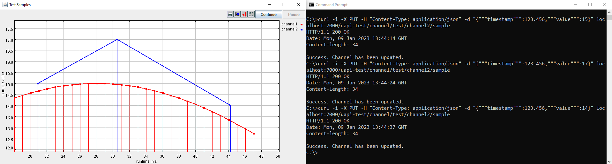

About
=====

The `online repository <https://github.com/AIT-Lablink/lablink-universal-api-client>`_ of the Lablink Universal Data Exchange API client includes a simlpe example demonstrating its use.
This example comprises a simple REST API implementing the `ERIGrid Universal Data Exchange API <https://erigrid2.github.io/JRA-3.1-api/universal-api.html>`_, which exposes a readable signal (``signal1``) and a writable signal (``signal2``).
The readable signal is continuously updated from another data source (a `Lablink CSV reader <https://ait-lablink.readthedocs.io/projects/ait-lablink-csv-client>`_) and its current value can be retrieved by the user (e.g., using ``curl`` from the command prompt).
The writable signal can be changed by the user (e.g., using ``curl`` from the command prompt).
When running the example, both signals are visualized using a plotter.

Prerequisites
=============

MQTT broker
-----------

An **MQTT broker** is required for running the example, for instance `Eclipse Mosquitto <https://mosquitto.org/>`_ or `EMQ <http://emqtt.io/>`_.

Required Lablink resources
--------------------------

The following Lablink resources are required for running the examples:

* `Configuration Server <https://ait-lablink.readthedocs.io/projects/lablink-config-server>`__: *config-0.1.1-jar-with-dependencies.jar*
* `Datapoint Bridge <https://ait-lablink.readthedocs.io/projects/lablink-datapoint-bridge>`__: *dpbridge-0.0.2-jar-with-dependencies.jar*
* `Lablink CSV Client <https://ait-lablink.readthedocs.io/projects/ait-lablink-csv-client>`__: *csvlient-0.0.2-jar-with-dependencies.jar*
* `Lablink Plotter <https://ait-lablink.readthedocs.io/projects/lablink-plotter>`__: *plotter-0.0.4-jar-with-dependencies*

When :doc:`building from source <installation>`, the corresponding JAR files will be copied to directory *target/dependency*.

Running the example (Windows)
=============================

Starting Lablink
----------------

Start all required Lablink clients by executing script :github_blob:`run_example.cmd <examples/run_example.cmd>` in subdirectory :github_tree:`examples`.
You can either double-click the file in the explorer or call it from the command line to execute it.

This script does the following things:

1. Start a local configuration server for all Lablink clients, making the content of database file *test-config.db* available via http://localhost:10101.
   Once the server is running, you can view the available configurations in a web browser via http://localhost:10101.
2. Start Lablink's `datapoint bridge <https://ait-lablink.readthedocs.io/projects/lablink-datapoint-bridge>`__, which routes signals between clients using the MQTT broker.
3. Run the Lablink clients, i.e., the Universal API client, the CSV reader client (which acts as data source) and the plotter client.

For each started client, a new command prompt window should appear, printing debug information about the client's status.
The Universal API client should continuously receive data from the CSV reader, which updates the value of signal ``signal1`` once per second.
You can check this by looking at the Universal API client's command prompt window, where you should see debug information for each new value.
This should look similar to the following:

.. code-block:: winbatch

   ...
   15:15:16.526 [pool-2-thread-1] INFO  UniversalApiClientDataService - signal1: set new value to '13.536'
   15:15:16.528 [pool-2-thread-1] DEBUG LlServiceBase - Service [signal1]: state changed from [13.346] to [13.536]!
   15:15:16.533 [pool-2-thread-1] DEBUG LlServiceBase - Notifying to the [1] registered listener...
   15:15:16.540 [pool-2-thread-1] INFO  UniversalApiClientDataNotifier - signal1: notifier -> state Changed from '13.346' to '13.536'
   15:15:16.540 [pool-2-thread-1] DEBUG MqttDataPointDouble - For datapoint [data service for signal signal1], the value is updated to [13.536].
   ...

Retrieve a signal value
-----------------------

In this example, the Universal API client has two signals: ``signal1`` is a read-only signal, ``signal2`` is a write-only signal.
Once the client is running, you can retrieve the latest value of ``signal1``.
There are various ways of retrieving data from REST interfaces, one way is using ``curl`` (which is by default already included on recent versions of Windows).
Use ``curl`` directly from the command prompt (``cmd.exe``): 

.. code-block:: winbatch

   curl -i localhost:7000/uapi-test/signal/signal1/state

This will return the API's response status (*200* in case of success) and the current value (state) of ``signal1``, for instance:

.. code-block:: winbatch

   HTTP/1.1 200 OK
   Date: Wed, 11 May 2022 12:58:12 GMT
   Transfer-encoding: chunked
   Content-type: application/json
   
   {"timestamp":1.65227389253E9,"value":14.33}

The returned value should agree with the latest value as visualized by the plotter.

.. image:: img/example_read_signal_value.png
   :align: center
   :alt: Retrieve current value of signal from Universal API client.

Set a signal value
------------------

The Universal API client also has a write-only signal called ``signal2``.
There are various ways of updating data through a REST interfaces, one way is again with the help of ``curl``.
Use ``curl`` directly from the command prompt (``cmd.exe``): 

.. code-block:: winbatch

   curl -i -X PUT -H "Content-Type: application/json" -d "{"""timestamp""":123.456,"""value""":10}" localhost:7000/uapi-test/signal/signal2/state

This will return the API's response status (*200* in case of success):

.. code-block:: winbatch

   HTTP/1.1 200 OK
   Date: Wed, 11 May 2022 13:08:17 GMT
   Content-length: 0

The new value for ``signal2`` should also be visualized by the plotter.

