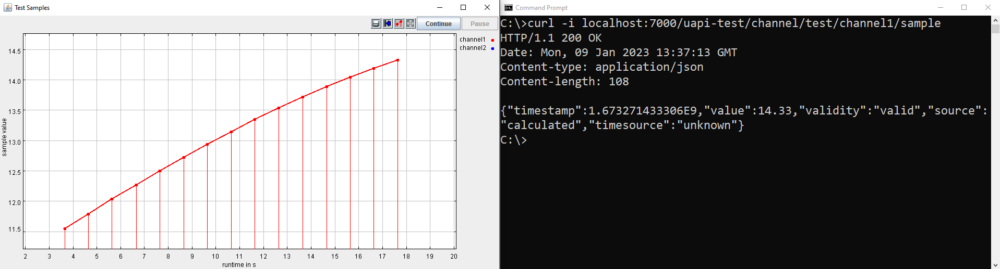

About
=====

The `online repository <https://github.com/AIT-Lablink/lablink-universal-api-client/tree/example>`_ of the Lablink Universal Data Exchange API client includes a simple example demonstrating its use.
This example comprises a simple REST API implementing the `ERIGrid Universal Data Exchange API <https://erigrid2.github.io/JRA-3.1-api/universal-api.html>`_ (v2.0), which exposes a readable channel (``test/channel1``) and a writable channel (``test/channel2``).
The readable channel is continuously updated from another data source (a `Lablink CSV reader <https://ait-lablink.readthedocs.io/projects/ait-lablink-csv-client>`_) and its current value (sample) can be retrieved by the user (e.g., using ``curl`` from the command prompt).
The writable channel can be changed by the user (e.g., using ``curl`` from the command prompt).
When running the example, both signals are visualized using a plotter.

Prerequisites
=============

MQTT broker
-----------

An **MQTT broker** is required for running the example, for instance `Eclipse Mosquitto <https://mosquitto.org/>`_ or `EMQ <http://emqtt.io/>`_.

Required Lablink resources
--------------------------

The following Lablink resources are required for running the examples:

* `Lablink Universal API Client <https://ait-lablink.readthedocs.io/projects/ait-lablink-universal-api-client>`__: *universalapiclient-0.1.0-jar-with-dependencies.jar*
* `Lablink CSV Client <https://ait-lablink.readthedocs.io/projects/ait-lablink-csv-client>`__: *csvlient-0.0.2-jar-with-dependencies.jar*
* `Lablink Plotter <https://ait-lablink.readthedocs.io/projects/lablink-plotter>`__: *plotter-0.0.4-jar-with-dependencies*
* `Datapoint Bridge <https://ait-lablink.readthedocs.io/projects/lablink-datapoint-bridge>`__: *dpbridge-0.0.3-jar-with-dependencies.jar*
* `Configuration Server <https://ait-lablink.readthedocs.io/projects/lablink-config-server>`__: *config-0.1.1-jar-with-dependencies.jar*

You can checkout the `example branch of the online repository <https://github.com/AIT-Lablink/lablink-universal-api-client/tree/example>`_ and run the installer script (Windows: ``install.cmd``, Linux: ``install.sh``).
This will copy the corresponding JAR files to directory *target/dependency*.

Running the example (Windows)
=============================

Starting Lablink
----------------

Start all required Lablink clients by executing script :github_blob:`run_example.cmd <examples/run_example.cmd>` in subdirectory :github_tree:`examples`.
You can either double-click the file in the explorer or call it from the command line to execute it.

This script does the following things:

1. Start a local configuration server for all Lablink clients, making the content of database file *test-config.db* available via http://localhost:10101.
   Once the server is running, you can view the available configurations in a web browser via http://localhost:10101.
2. Start Lablink's `datapoint bridge <https://ait-lablink.readthedocs.io/projects/lablink-datapoint-bridge>`__, which routes signals between clients using the MQTT broker.
3. Run the Lablink clients, i.e., the Universal API client, the CSV reader client (which acts as data source) and the plotter client.

For each started client, a new command prompt window should appear, printing debug information about the client's status.
The Universal API client should continuously receive data from the CSV reader, which updates the sample value of channel ``test/channel1`` once per second.
You can check this by looking at the Universal API client's command prompt window, where you should see debug information for each new value.
This should look similar to the following:

.. code-block:: winbatch

   ...
   14:24:42.883 [pool-2-thread-1] INFO  DataServiceDouble - channel1: set new value to '14.193'
   14:24:42.883 [pool-2-thread-1] DEBUG LlServiceBase - Service [channel1]: state changed from [14.33] to [14.193]!
   14:24:42.883 [pool-2-thread-1] DEBUG LlServiceBase - Notifying to the [1] registered listener...
   14:24:42.883 [pool-2-thread-1] INFO  SampleDataNotifier - channel1: notifier -> state Changed from '14.33' to '14.193'
   14:24:42.898 [pool-2-thread-1] DEBUG MqttDataPointDouble - For datapoint [data service for channel test/channel1], the value is updated to [14.193].
   ...

List all available channels
---------------------------

In this example, the Universal API client has two channels:

* ``test/channel1`` is a read-only channel 
* ``test/channel2`` is a write-only channel

You can retrieve this information directly from the client.
There are various ways of retrieving data from REST interfaces, one way is using ``curl`` (which is by default already included on recent versions of Windows).
Use ``curl`` directly from the command prompt (``cmd.exe``): 

.. code-block:: winbatch

   curl -i localhost:7000/uapi-test/channels

This will return the API's response status (*200* in case of success) and the list of available signals:

.. code-block:: winbatch

   HTTP/1.1 200 OK
   Date: Mon, 09 Jan 2023 13:29:51 GMT
   Content-type: application/json
   Content-length: 222
   [{"id":"test/channel2","payload":"samples","datatype":"float","writable":true,"readable":false},{"id":"test/channel1","payload":"samples","datatype":"float","range":{"min":5.0,"max":15.0},"writable":false,"readable":true}]

Retrieve a channel sample
-------------------------

Once the client is running, you can retrieve the latest sample value of channel ``test/channel1``.
To do so, you can use ``curl`` directly from the command prompt (``cmd.exe``): 

.. code-block:: winbatch

   curl -i localhost:7000/uapi-test/channel/test/channel1/sample

This will return the API's response status (*200* in case of success) and the current sample value of ``test/channel1``, for instance:

.. code-block:: winbatch

   HTTP/1.1 200 OK
   Date: Mon, 09 Jan 2023 13:32:20 GMT
   Content-type: application/json
   Content-length: 109
   {"timestamp":1.673271140676E9,"value":12.034,"validity":"valid","source":"calculated","timesource":"unknown"}

The returned value should agree with the latest value as visualized by the plotter.

Set a sample value
------------------

The Universal API client also has a write-only channel called ``test/channel2``.
There are various ways of updating data through a REST interfaces, one way is again with the help of ``curl``.
Use ``curl`` directly from the command prompt (``cmd.exe``): 

.. code-block:: winbatch

   curl -i -X PUT -H "Content-Type: application/json" -d "{"""timestamp""":123.456,"""value""":13}" localhost:7000/uapi-test/channel/test/channel2/sample

This will return the API's response status (*200* in case of success):

.. code-block:: winbatch

   HTTP/1.1 200 OK
   Date: Mon, 09 Jan 2023 13:42:12 GMT
   Content-length: 34
   Success. Channel has been updated.

The new sample value for ``test/channel2`` should also be visualized by the plotter.

.. image:: img/example_write_signal_value.png
   :align: center
   :alt: Update of value of signal from Universal API client.
